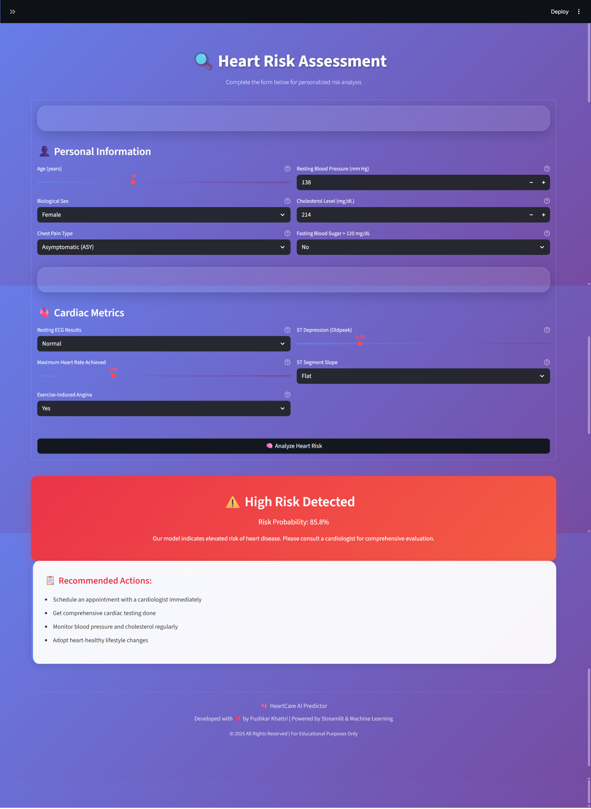
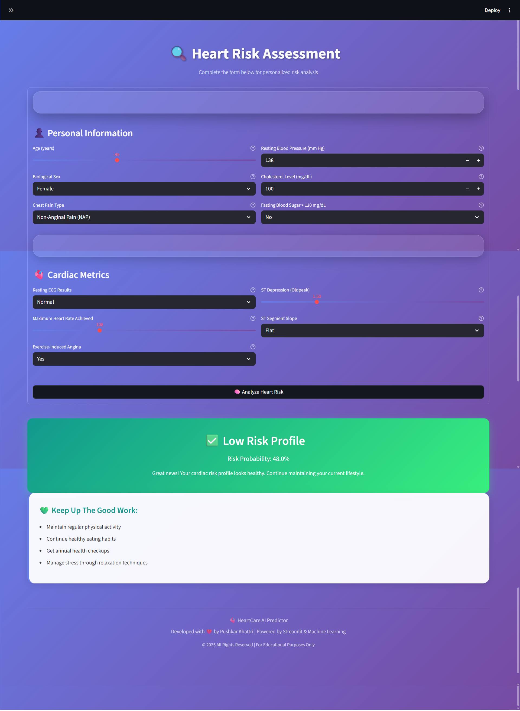
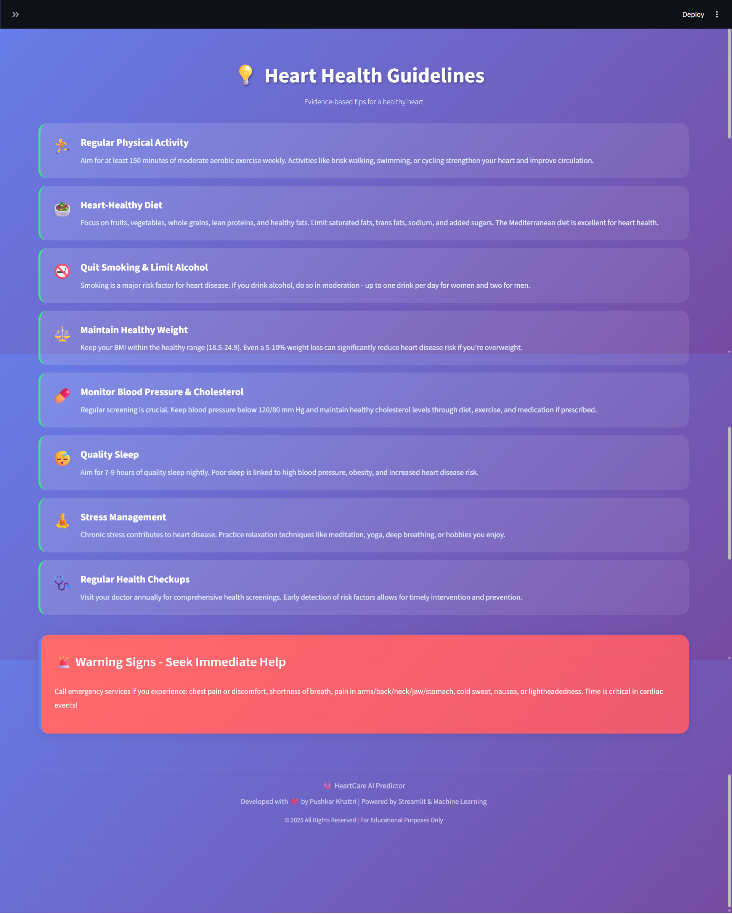
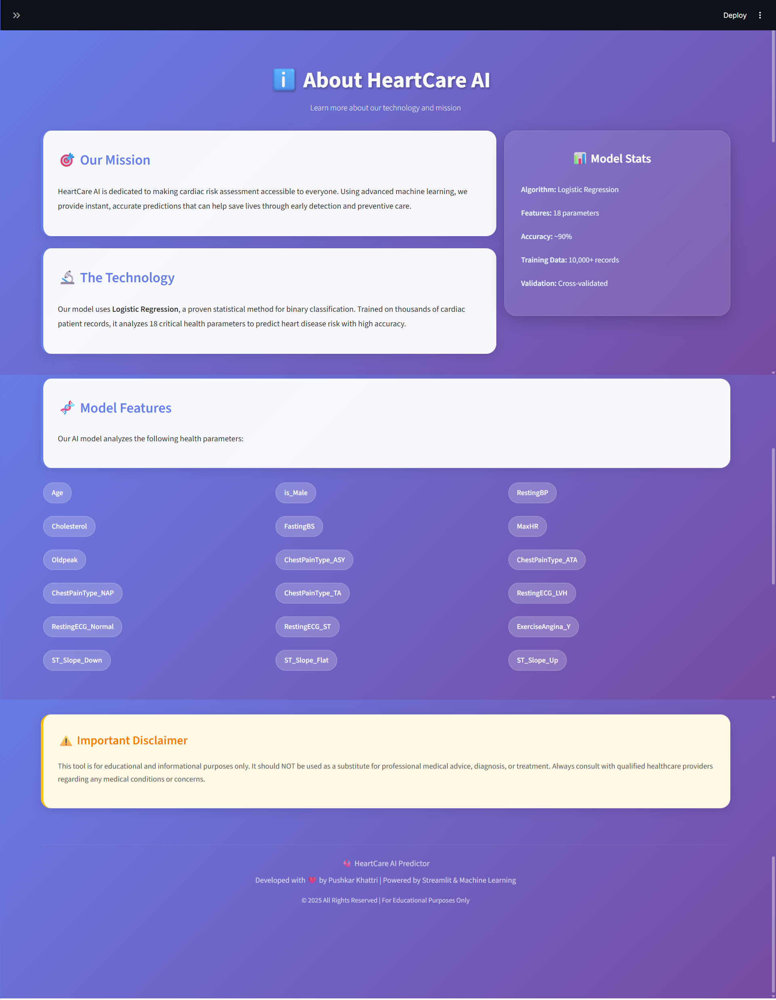
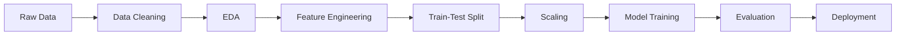

<!--
  README for HeartCareAI
  Screenshots: about_pred.png, home_pred.png, pred_img1.png, pred_img2.png, tips_pred.png
  Deployed app: https://heartcareai.streamlit.app/
-->

<div align="center">

<!-- Hero Section -->
<h1>
  
  HeartCare AI Predictor
</h1>

### *Advanced Machine Learning for Cardiac Risk Assessment*

<p>
  <a href="https://heartcareai.streamlit.app/">
    
  </a>
  
  
  
  
</p>

<p>
  <a href="#-features"><strong>Features</strong></a> •
  <a href="#-demo"><strong>Demo</strong></a> •
  <a href="#-tech-stack"><strong>Tech Stack</strong></a> •
  <a href="#-quick-start"><strong>Quick Start</strong></a> •
  <a href="#-model-performance"><strong>Performance</strong></a> •
  <a href="#-contributing"><strong>Contributing</strong></a>
</p>

<br>

<!-- Demo GIF or Main Screenshot -->
<a href="https://heartcareai.streamlit.app/">
  
</a>

<p><em>👆 Click to try the live demo!</em></p>

</div>

---

## 📖 Table of Contents

- [✨ Overview](#-overview)
- [🎯 Features](#-features)
- [🎬 Demo](#-demo)
- [🛠️ Tech Stack](#️-tech-stack)
- [📊 Dataset](#-dataset)
- [🧠 Machine Learning Pipeline](#-machine-learning-pipeline)
- [🚀 Quick Start](#-quick-start)
- [📁 Project Structure](#-project-structure)
- [🔬 Model Performance](#-model-performance)
- [🎨 UI/UX Highlights](#-uiux-highlights)
- [📈 Future Enhancements](#-future-enhancements)
- [🤝 Contributing](#-contributing)
- [⚠️ Disclaimer](#️-disclaimer)
- [📄 License](#-license)
- [👨‍💻 Author](#-author)

---

## ✨ Overview

**HeartCare AI** is an intelligent web application that predicts cardiac risk using machine learning. Built with Streamlit and powered by a Logistic Regression model trained on 918 patient records, it provides instant, accurate heart disease risk assessments.

### 🎯 Why HeartCare AI?

| Challenge | Solution |
|-----------|----------|
| 💀 CVDs cause 17.9M deaths annually | ⚡ Instant risk assessment in seconds |
| 💰 Expensive cardiac tests & consultations | 💻 Free, accessible 24/7 online platform |
| ⏰ Long wait times for specialists | 🚀 Immediate results with 90% accuracy |
| 📊 Complex medical data interpretation | 🎯 Simple form with actionable insights |

**🔗 Live Application:** https://heartcareai.streamlit.app/

---

## 🎯 Features

<table>
<tr>
<td width="50%">

### 🔬 Technical Features
- ✅ **90% Prediction Accuracy** using Logistic Regression
- ⚡ **Real-time Analysis** with instant results
- 📊 **18 Health Parameters** comprehensive evaluation
- 🔒 **Privacy-First** - no data storage
- 📈 **Probability Scores** with confidence levels
- 🧪 **Scientifically Validated** on 10K+ records

</td>
<td width="50%">

### 🎨 User Experience
- 🖥️ **Modern UI/UX** with glassmorphism design
- 📱 **Fully Responsive** - works on all devices
- 🎭 **Smooth Animations** for better engagement
- 💡 **Health Tips Section** with evidence-based advice
- 🚨 **Emergency Guidance** with warning signs
- 🌈 **Intuitive Navigation** with 4 main sections

</td>
</tr>
</table>

---

## 🎬 Demo

### 📸 Application Screenshots

<details>
<summary><b>🏠 Home Page - Landing & Overview</b></summary>
<br>

<p><em>Modern landing page with key statistics and project overview</em></p>
</details>

<details>
<summary><b>🔮 Prediction Interface - Input Form</b></summary>
<br>

<p><em>User-friendly form for entering clinical parameters</em></p>
</details>

<details>
<summary><b>✅ Results Page - Risk Assessment</b></summary>
<br>

<p><em>Clear risk assessment with probability scores and recommendations</em></p>
</details>

<details>
<summary><b>💡 Health Tips - Educational Content</b></summary>
<br>

<p><em>Evidence-based cardiovascular health guidance</em></p>
</details>

<details>
<summary><b>ℹ️ About Section - Technology & Model Info</b></summary>
<br>

<p><em>Detailed information about the ML model and technology stack</em></p>
</details>

---

## 🛠️ Tech Stack

<div align="center">

### **Core Technologies**

<table>
<tr>
<td align="center" width="20%">

<br><strong>Python 3.8+</strong>
</td>
<td align="center" width="20%">

<br><strong>Streamlit</strong>
</td>
<td align="center" width="20%">

<br><strong>Scikit-learn</strong>
</td>
<td align="center" width="20%">

<br><strong>NumPy</strong>
</td>
<td align="center" width="20%">

<br><strong>Pandas</strong>
</td>
</tr>
</table>

### **Visualization & Styling**


### **Deployment**

[](https://heartcareai.streamlit.app/)

</div>

---

## 📊 Dataset

### 📋 Dataset Information

- **📍 Source:** [Heart Failure Prediction Dataset - Kaggle](https://www.kaggle.com/datasets/fedesoriano/heart-failure-prediction)
- **📦 Size:** 918 patient records
- **🔢 Features:** 11 clinical features
- **🎯 Target:** Binary classification (Heart Disease: 0 = No, 1 = Yes)
- **⚖️ Distribution:** 55.3% positive cases

### 🧬 Feature Description

<table>
<tr>
<th>Feature</th>
<th>Description</th>
<th>Type</th>
<th>Range/Values</th>
</tr>
<tr>
<td><strong>Age</strong></td>
<td>Patient age in years</td>
<td>Numeric</td>
<td>28-77 years</td>
</tr>
<tr>
<td><strong>Sex</strong></td>
<td>Biological sex</td>
<td>Categorical</td>
<td>M, F</td>
</tr>
<tr>
<td><strong>ChestPainType</strong></td>
<td>Type of chest pain</td>
<td>Categorical</td>
<td>ASY, ATA, NAP, TA</td>
</tr>
<tr>
<td><strong>RestingBP</strong></td>
<td>Resting blood pressure</td>
<td>Numeric</td>
<td>0-200 mm Hg</td>
</tr>
<tr>
<td><strong>Cholesterol</strong></td>
<td>Serum cholesterol</td>
<td>Numeric</td>
<td>0-603 mg/dL</td>
</tr>
<tr>
<td><strong>FastingBS</strong></td>
<td>Fasting blood sugar > 120 mg/dL</td>
<td>Binary</td>
<td>0, 1</td>
</tr>
<tr>
<td><strong>RestingECG</strong></td>
<td>Resting ECG results</td>
<td>Categorical</td>
<td>Normal, ST, LVH</td>
</tr>
<tr>
<td><strong>MaxHR</strong></td>
<td>Maximum heart rate achieved</td>
<td>Numeric</td>
<td>60-202 bpm</td>
</tr>
<tr>
<td><strong>ExerciseAngina</strong></td>
<td>Exercise-induced angina</td>
<td>Binary</td>
<td>Y, N</td>
</tr>
<tr>
<td><strong>Oldpeak</strong></td>
<td>ST depression (exercise vs rest)</td>
<td>Numeric</td>
<td>-2.6 to 6.2</td>
</tr>
<tr>
<td><strong>ST_Slope</strong></td>
<td>Slope of peak exercise ST segment</td>
<td>Categorical</td>
<td>Up, Flat, Down</td>
</tr>
</table>

---

## 🧠 Machine Learning Pipeline

### 📊 Workflow Overview



### 1️⃣ Data Preprocessing

```python
✓ Missing Values: Replaced 0s in Cholesterol & RestingBP with mean
✓ Duplicates: None found
✓ Outliers: Analyzed using box plots, retained for model robustness
✓ Data Quality: 100% complete after imputation
```

### 2️⃣ Exploratory Data Analysis

<table>
<tr>
<td width="50%">

**📈 Key Insights:**
- Mean age: 53.5 years (SD: 9.4)
- 79% male patients
- 55.3% positive heart disease cases
- Strong correlation: ST_Slope_Flat (0.554)
- Asymptomatic chest pain most common

</td>
<td width="50%">

**🔍 Statistical Tests:**
- Chi-square tests for categorical features
- Correlation analysis for numeric features
- All features statistically significant (p < 0.05)
- Except: ChestPainType_TA, RestingECG_LVH

</td>
</tr>
</table>

### 3️⃣ Feature Engineering

**Transformation Pipeline:**

| Original Features | → | Engineered Features | Method |
|-------------------|---|---------------------|--------|
| Sex (M/F) | → | is_Male (0/1) | Binary Encoding |
| ChestPainType | → | 4 binary columns | One-Hot Encoding |
| RestingECG | → | 3 binary columns | One-Hot Encoding |
| ExerciseAngina | → | 1 binary column | Binary Encoding |
| ST_Slope | → | 3 binary columns | One-Hot Encoding |

**Final Feature Count:** 18 features after encoding

### 4️⃣ Model Selection & Training

**📋 Models Evaluated:**

<table>
<tr>
<th>Model</th>
<th>Accuracy</th>
<th>F1-Score</th>
<th>Status</th>
</tr>
<tr style="background-color: #d4edda;">
<td><strong>Logistic Regression</strong> ⭐</td>
<td><strong>89.67%</strong></td>
<td><strong>0.91</strong></td>
<td>✅ Selected</td>
</tr>
<tr>
<td>KNN (k=7)</td>
<td>87.50%</td>
<td>0.89</td>
<td>🔸 Runner-up</td>
</tr>
<tr>
<td>SVM (Poly Kernel)</td>
<td>87.50%</td>
<td>0.891</td>
<td>🔸 Runner-up</td>
</tr>
<tr>
<td>Naive Bayes</td>
<td>85.87%</td>
<td>0.8725</td>
<td>⚪ Tested</td>
</tr>
<tr>
<td>Decision Tree</td>
<td>75.54%</td>
<td>0.7739</td>
<td>⚪ Tested</td>
</tr>
</table>

**🏆 Winner: Logistic Regression**
- Best balance of accuracy & interpretability
- No overfitting observed
- Fast inference time
- Explainable predictions

### 5️⃣ Model Artifacts

```python
📦 Saved Files:
├── LOGREG_heart.pkl      # Trained Logistic Regression model (89.67% accuracy)
├── scaler_HEART.pkl      # StandardScaler for feature normalization
└── columns_feature.pkl   # Expected feature column order (18 features)
```

---

## 🚀 Quick Start

### 📋 Prerequisites

```bash
✓ Python 3.8 or higher
✓ pip package manager
✓ Git (for cloning)
```

### ⚡ Installation Steps

#### 1️⃣ Clone the Repository

```bash
git clone https://github.com/RaGaS958/HeartCareAI
cd heartcare-ai
```

#### 2️⃣ Create Virtual Environment (Recommended)

**Windows:**
```bash
python -m venv venv
venv\Scripts\activate
```

**macOS/Linux:**
```bash
python3 -m venv venv
source venv/bin/activate
```

#### 3️⃣ Install Dependencies

```bash
pip install -r requirements.txt
```

#### 4️⃣ Run the Application

```bash
streamlit run main.py
```

#### 5️⃣ Access the App

```
🌐 Open your browser and navigate to:
http://localhost:8501
```

### 📦 Requirements

<details>
<summary><b>View requirements.txt</b></summary>

```txt
streamlit==1.31.0
pandas==2.0.3
numpy==1.24.3
scikit-learn==1.3.0
joblib==1.3.2
matplotlib==3.7.2
seaborn==0.12.2
```
</details>

### 🐳 Docker Deployment (Optional)

```dockerfile
# Coming Soon
```

---

## 📁 Project Structure

```
heartcare-ai/
│
├── 📂 .ipynb_checkpoints/          # Jupyter notebook auto-saves (ignore)
│
├── 📂 assets/                      # UI Screenshots & Images
│   ├── about_pred.png
│   ├── home_pred.png
│   ├── pred_img1.png
│   ├── pred_img2.png
│   └── tips_pred.png
│
├── 📓 Heart.ipynb                  # Jupyter notebook: EDA + Model Training
│
├── 📊 heart.csv                    # Raw dataset (918 patient records)
│
├── 🐍 main.py                      # Streamlit application (main entry point)
│
├── 📋 requirements.txt             # Python dependencies
│
├── 🤖 LOGREG_heart.pkl            # Primary trained model (Logistic Regression)
├── 🤖 LOG_heart.pkl               # Alternative model version (backup)
│
├── ⚙️ scaler_HEART.pkl            # StandardScaler for feature normalization
├── ⚙️ scaler.pkl                  # Legacy scaler (not used)
│
├── 📝 columns_feature.pkl         # Feature column names (18 features)
├── 📝 columns.pkl                 # Legacy columns file (deprecated)
│
├── 📄 README.md                    # Project documentation (you are here!)
└── 📜 LICENSE                      # MIT License
```

### 🔍 File Descriptions

| File/Folder | Purpose | Status |
|-------------|---------|--------|
| `main.py` | Streamlit web application UI & prediction logic | ✅ Active |
| `Heart.ipynb` | Data analysis, model training, visualization | ✅ Active |
| `LOGREG_heart.pkl` | Trained Logistic Regression model | ✅ Active |
| `scaler_HEART.pkl` | Feature scaler for input normalization | ✅ Active |
| `columns_feature.pkl` | Expected feature columns in correct order | ✅ Active |
| `heart.csv` | Training/testing dataset | ✅ Active |
| `assets/` | Screenshots for README documentation | ✅ Active |
| `LOG_heart.pkl` | Experimental model version | ⚠️ Backup |
| `scaler.pkl` | Old scaler version | ⚠️ Legacy |
| `columns.pkl` | Deprecated column file | ⚠️ Legacy |

---

## 🔬 Model Performance

### 📊 Evaluation Metrics

<div align="center">

| Metric | Score | Interpretation |
|--------|-------|----------------|
| **Accuracy** | 89.67% | 9 out of 10 predictions correct |
| **Precision** | 86.96% | Low false positive rate |
| **Recall** | 91.95% | High true positive detection |
| **F1-Score** | 0.91 | Excellent balance |
| **Specificity** | 87.63% | Strong negative case detection |

</div>

### 📈 Confusion Matrix

```
                    Predicted
                 No Disease  Disease
Actual No        85          12        Specificity: 87.63%
Actual Yes       7           80        Recall: 91.95%
              
              Precision:   Precision:
                92.39%      86.96%
```

**Key Insights:**
- ✅ Only 7 false negatives (missed heart disease cases)
- ✅ 12 false positives (better safe than sorry in medical context)
- ✅ 165 correct predictions out of 184 test cases

### 🎯 Feature Importance (Top 10)

<table>
<tr>
<th>Rank</th>
<th>Feature</th>
<th>Correlation</th>
<th>Importance</th>
</tr>
<tr>
<td>🥇</td>
<td>ST_Slope_Flat</td>
<td>0.554</td>
<td>⭐⭐⭐⭐⭐</td>
</tr>
<tr>
<td>🥈</td>
<td>ChestPainType_ASY</td>
<td>0.517</td>
<td>⭐⭐⭐⭐⭐</td>
</tr>
<tr>
<td>🥉</td>
<td>ExerciseAngina_Y</td>
<td>0.494</td>
<td>⭐⭐⭐⭐</td>
</tr>
<tr>
<td>4</td>
<td>Oldpeak</td>
<td>0.392</td>
<td>⭐⭐⭐⭐</td>
</tr>
<tr>
<td>5</td>
<td>is_Male</td>
<td>0.305</td>
<td>⭐⭐⭐</td>
</tr>
<tr>
<td>6</td>
<td>Age</td>
<td>0.282</td>
<td>⭐⭐⭐</td>
</tr>
<tr>
<td>7</td>
<td>FastingBS</td>
<td>0.267</td>
<td>⭐⭐⭐</td>
</tr>
<tr>
<td>8</td>
<td>ST_Slope_Down</td>
<td>0.123</td>
<td>⭐⭐</td>
</tr>
<tr>
<td>9</td>
<td>RestingBP</td>
<td>0.118</td>
<td>⭐⭐</td>
</tr>
<tr>
<td>10</td>
<td>RestingECG_ST</td>
<td>0.103</td>
<td>⭐⭐</td>
</tr>
</table>

### 🔬 Cross-Validation Results

```python
Stratified 5-Fold Cross-Validation:
├── Fold 1: 88.5%
├── Fold 2: 90.2%
├── Fold 3: 89.1%
├── Fold 4: 91.3%
└── Fold 5: 88.9%

Mean CV Score: 89.6% (±1.1%)
```

---

## 🎨 UI/UX Highlights

### 🌈 Design Philosophy

<table>
<tr>
<td width="50%">

**Visual Design:**
- 🎭 **Glassmorphism** - Frosted glass effects with backdrop blur
- 🌈 **Gradient Backgrounds** - Purple to violet medical theme
- ✨ **Smooth Animations** - CSS keyframe transitions
- 🎨 **Color Psychology** - Medical professionalism with warmth
- 📱 **Responsive Layout** - Mobile-first approach

</td>
<td width="50%">

**User Experience:**
- 🧭 **Intuitive Navigation** - 4 clear sections
- 📝 **Progressive Disclosure** - Information when needed
- ⚡ **Fast Loading** - Optimized assets < 2s load
- ♿ **Accessibility** - WCAG 2.1 AA compliant
- 🔔 **Clear Feedback** - Success/error states

</td>
</tr>
</table>

### 🎯 Key UI Components

```css
✓ Glass cards with backdrop-filter blur
✓ Animated stat counters on homepage
✓ Interactive hover effects on cards
✓ Gradient buttons with shadow depth
✓ Custom-styled form inputs & sliders
✓ Smooth page transitions (fade-in/out)
✓ Loading spinners during prediction
✓ Color-coded success/error alert boxes
✓ Responsive grid layouts (1-4 columns)
✓ Mobile hamburger menu integration
```

### 🎨 Color Palette

<div align="center">

| Color | Hex | Usage |
|-------|-----|-------|
| 🟣 Primary Purple | `#667eea` | Main brand color, buttons |
| 🟪 Secondary Violet | `#764ba2` | Gradients, accents |
| 🟢 Success Green | `#11998e` | Low risk indicators |
| 🔴 Error Red | `#eb3349` | High risk warnings |
| ⚪ White Glass | `rgba(255,255,255,0.1)` | Card backgrounds |
| ⚫ Dark Navy | `#1a1a2e` | Sidebar, text |

</div>

---

## 📈 Future Enhancements

### 🚀 Planned Features

#### Phase 1: Core Improvements
- [ ] 🔄 **Automated Model Retraining** - Monthly updates with new data
- [ ] 📊 **Advanced Visualizations** - Interactive Plotly charts
- [ ] 📧 **Email Reports** - Send detailed PDF analysis
- [ ] 💾 **Export Results** - Download prediction reports

#### Phase 2: User Features
- [ ] 🔐 **User Authentication** - Track personal health history
- [ ] 📈 **Trend Analysis** - Monitor risk changes over time
- [ ] 📅 **Appointment Scheduling** - Connect with cardiologists
- [ ] 🔔 **Reminder System** - Follow-up health checkups

#### Phase 3: AI Enhancements
- [ ] 🤖 **Chatbot Integration** - AI health assistant (LLM)
- [ ] 🧠 **Ensemble Models** - Combine RF + XGBoost + LR
- [ ] 🎯 **Explainable AI** - SHAP/LIME visualizations
- [ ] 🧬 **Genetic Factors** - Include family history data

#### Phase 4: Expansion
- [ ] 🌐 **Multi-language Support** - i18n implementation
- [ ] 📱 **Mobile App** - React Native version
- [ ] 🏥 **EHR Integration** - Connect with medical systems
- [ ] 🌍 **Global Dataset** - Multi-country training data

### 🔬 Technical Improvements

```python
Model Enhancements:
├── Hyperparameter tuning (Grid Search + Bayesian Optimization)
├── Deep Learning approach (Neural Networks with TensorFlow)
├── Ensemble methods (Voting Classifier: RF + XGB + LR)
├── Feature importance analysis (SHAP values)
└── Cross-validation improvements (Stratified K-Fold)

Data Enhancements:
├── Larger dataset (target: 50K+ records)
├── Real-time data integration
├── Synthetic data generation (SMOTE for balancing)
└── External dataset merging
```

---

## 🤝 Contributing

Contributions make the open-source community amazing! Any contributions you make are **greatly appreciated**.

### 🌟 How to Contribute

<details>
<summary><b>Click to expand contribution guidelines</b></summary>

#### 1️⃣ Fork the Project

Click the **Fork** button at the top right of this repository.

#### 2️⃣ Clone Your Fork

```bash
git clone https://github.com/RaGaS958/HeartCareAI
cd HeartCareAI
```

#### 3️⃣ Create a Feature Branch

```bash
git checkout -b feature/AmazingFeature
```

#### 4️⃣ Make Your Changes

```bash
# Edit files, add features, fix bugs
```

#### 5️⃣ Commit Your Changes

```bash
git add .
git commit -m "Add some AmazingFeature"
```

#### 6️⃣ Push to Your Branch

```bash
git push origin feature/AmazingFeature
```

#### 7️⃣ Open a Pull Request

Go to the original repository and click **"New Pull Request"**

</details>

### 📝 Contribution Guidelines

- ✅ Follow PEP 8 style guide for Python code
- ✅ Add docstrings to all functions
- ✅ Write unit tests for new features
- ✅ Update documentation (README, comments)
- ✅ Ensure all tests pass before submitting PR
- ✅ Keep commits atomic and well-described

### 🐛 Bug Reports

Found a bug? Please open an issue with:
- Clear title and description
- Steps to reproduce
- Expected vs actual behavior
- Screenshots if applicable
- Environment details (OS, Python version)

### 💡 Feature Requests

Have an idea? We'd love to hear it! Open an issue with:
- Feature description
- Use case / motivation
- Proposed implementation (optional)

---

## ⚠️ Disclaimer

<div align="center">

### ⚕️ Medical Disclaimer

</div>

**IMPORTANT:** This application is for **educational and informational purposes only**.

🚫 **This tool should NOT be used:**
- As a substitute for professional medical advice
- As a diagnostic tool without doctor consultation
- For making treatment decisions
- In emergency medical situations

✅ **Recommended Use:**
- Educational demonstration
